## SymGenerator

### 介绍

专门为Tr插件开发的符号生成器，也可用于Player方案的通用BDS插件开发,如果想了解BDS插件开发的原理可参考[这里](https://github.com/hhhxiao/TrapDoor/blob/1.17.11.01/%E5%8E%9F%E7%90%86%E5%92%8C%E8%AE%BE%E8%AE%A1.md)
### 使用

该软件有`dump,exp,check,gen`这四个几子命令，每个指令分别承担不同的作用。

#### dump

该命令会调用`cvdump -headers -p`命令从`bedrock_server.pdb`中导出基本的符号信息到文本文件中， 因此你的当前路径需要存在`cvdump.exe`,或者将`cvdump.exe`所在目录加入环境变量的path中。 导出的文件的基本格式如下图所示:

```text
Microsoft (R) Debugging Information Dumper  Version 14.00.23611
Copyright (C) Microsoft Corporation.  All rights reserved.
*** PUBLICS

S_PUB32: [0001:00452070], Flags: 00000002, ??_EBottleItem@@UEAAPEAXI@Z
S_PUB32: [0001:0051C070], Flags: 00000002, ??_EKnockbackRoarGoal@@UEAAPEAXI@Z
...
*** SECTION HEADERS


SECTION HEADER #1
   .text name
 1A1C3EC virtual size
    1000 virtual address
 1A1C400 size of raw data
     400 file pointer to raw data
       0 file pointer to relocation table
       0 file pointer to line numbers
       0 number of relocations
       0 number of line numbers
60000020 flags
         Code
         (no align specified)
         Execute Read
...
```

该子命令的用法如下所示：

```shell
trhelper dump [pdb file] -o [header file]
```

#### exp

根据上一步导出的的文本文件计算符号的RVA和函数原型并输出到文本文件中 使用的指令如下图所示:

```shell
trhelper exp [header file] -o [system symbol file]
```

生成的文件如下所示:

```text
...
0X204E024
int `bool __cdecl StateSerializationUtils::fromNBT<enum AnvilDamage>(class Tag const & __ptr64,int & __ptr64)'::`2'::$TSS0
?$TSS0@?1???$fromNBT@W4AnvilDamage@@@StateSerializationUtils@@YA_NAEBVTag@@AEAH@Z@4HA

0X2057304
int `bool __cdecl StateSerializationUtils::fromNBT<enum BlockColor>(class Tag const & __ptr64,int & __ptr64)'::`2'::$TSS0
?$TSS0@?1???$fromNBT@W4BlockColor@@@StateSerializationUtils@@YA_NAEBVTag@@AEAH@Z@4HA
...
```

其中每三行构成一个条目，一个条目是一个符号的信息:第一行是该符号的RVA，第二行是该符号的函数原型，第三行是该符号本身，不同的条目之间用空行隔开.

> 这一步导出的符号不是完整的符号，Trhelper根据关键词屏蔽了部分一般开发大概率不会使用的符号。

#### check

该步骤的作用根据第二步导出的系统（也就是全局）符号文件和用户定义的符号文件来查找符号是否缺失. 用户符号文件就是用户需要hook或者call的符号裂变，该文件的格式如下图所示:

```text
#区块更新
?tick@LevelChunk@@QEAAXAEAVBlockSource@@AEBUTick@@@Z

#随机刻更新
?tickBlocks@LevelChunk@@QEAAXAEAVBlockSource@@@Z
```
Trhelper只会识别不以`#`字符开头的非空行的符号，符号请勿换行，也请勿添加其它内容

执行下面的命令后，软件会在system symbol file 中查找用户符号中的每一个条目，没有找到的条目会进行提示。
```shell
trhelper check -s [system symbol file] -u [user symbol file]
```
#### gen
该步骤是根据第二步导出的符号文件和用户定义符号文件来生成cpp头文件.生成的头文件会打印在标准输出流，为了方便使用，你可以用`>`将内容重定向到头文件中。
使用下方的命令
```shell
trhelper gen -s [system symbol file] -u [user symbol file]
```
生成的头文件的格式如下图所示：
```cpp
#pragma  once
namespace SymHook{
   //[1]?_spawnStructureMob@Spawner@@AEAAXAEAVBlockSource@@AEBVBlockPos@@AEBUHardcodedSpawningArea@LevelChunk@@AEBVSpawnConditions@@@Z;
   //private: void __cdecl Spawner::_spawnStructureMob(class BlockSource & __ptr64,class BlockPos const & __ptr64,struct LevelChunk::HardcodedSpawningArea const & __ptr64,class SpawnConditions const & __ptr64) __ptr64
    constexpr uint64_t  Spawner_spawnStructureMob_98a1693e = 0x01121890;

   //[2]?displayLocalizableMessage@CommandUtils@@YAX_NAEAVPlayer@@AEBV?$basic_string@DU?$char_traits@D@std@@V?$allocator@D@2@@std@@AEBV?$vector@V?$basic_string@DU?$char_traits@D@std@@V?$allocator@D@2@@std@@V?$allocator@V?$basic_string@DU?$char_traits@D@std@@V?$allocator@D@2@@std@@@2@@4@@Z;
   //void __cdecl CommandUtils::displayLocalizableMessage(bool,class Player & __ptr64,class std::basic_string<char,struct std::char_traits<char>,class std::allocator<char> > const & __ptr64,class std::vector<class std::basic_string<char,struct std::char_traits<char>,class std::allocator<char> >,class std::allocator<class std::basic_string<char,struct std::char_traits<char>,class std::allocator<char> > > > const & __ptr64)
    constexpr uint64_t  CommandUtils_displayLocalizableMessage_24be62e9 = 0x007815B0;
}
```
其中符号变量的构成规则为: `{class name}_{function name}_{MD5(symbol)}`,如果出现两个连续的`_`则只显示一个.

### 开发流程
#### 工作流
使用本软件做符号管理的基本流程如下同所示:


####  使用脚本进行自动符号更新

你可以写一个python/powershell脚本来自动更新符号。
